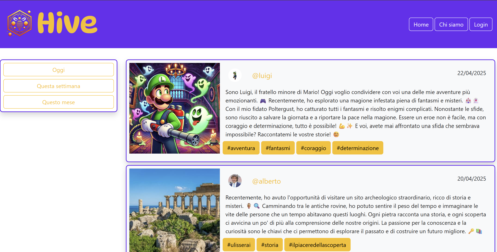

# Hive 🐝

## Description
A dynamic, server-side rendered blogging application named **Hive**, developed as the practical project for the **Introduzione alle Applicazioni Web** (Introduction to Web Applications) course during my Bachelor's Degree in Computer Engineering at **Politecnico di Torino**. The platform features dynamic content publication, clean templating, and user interaction, built with a Python backend using the Flask microframework and styled with semantic HTML5 and custom CSS3.

## Core Competencies & Architecture

* **Server-Side Rendering & Routing:** Structured request handling, dynamic URL routing, endpoint mapping, and HTTP verb management (`GET`, `POST`) using Flask.
* **Template Engine Integration:** Dynamic rendering of posts, metadata, and layouts using Jinja2 templates, template inheritance (`base.html`), and modular UI components.
* **CRUD & State Management:** Implementation of core blog mechanisms, including creating, reading, editing, and deleting articles alongside user sessions and input validation.
* **Frontend Design:** Clean, semantic HTML5 structure paired with custom CSS3 stylesheets for layout responsiveness, typography hierarchy, and UI component styling.
* **Data Persistence:** Relational data storage for posts, authors, and timestamps (using SQLite).

## Tech Stack & Tools

* **Backend Framework:** Python3, Flask
* **Templating Engine:** Jinja2
* **Frontend:** HTML5, CSS3

## Getting Started
Ensure Python 3 and pip are installed on your machine:

### 1. Clone the repository
git clone [https://github.com/your-username/your-repo-name.git](https://github.com/your-username/your-repo-name.git)
cd your-repo-name

### 2. (Optional) Create and activate a virtual environment
python3 -m venv venv
source venv/bin/activate  # On Windows: venv\Scripts\activate

### 3. Install dependencies
pip install -r requirements.txt

### 4. Launch the application
flask run

### Or run in development mode with live reloading:
flask run --debug